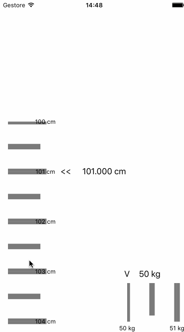

# Ruler
Support Horizontal &amp; Vertical, It will base on UIScrollView's frame to adjust size.



## How To Use
Remember to set AutoLayout correctly.
```swift
    @IBOutlet weak var rulerScrollView: RulerScrollView!
    
    override func viewDidLoad() {
        super.viewDidLoad()
        rulerScrollView.initRuler(self, imageNameForUnit: "unit", rulerAutoAlignToCloseInt: true)
    }
```

## Settings
```swift
//--- Full Settings ---
//    private var rulerScrollViewDelegate: RulerScrollViewDelegate? = nil
//    private var direction: RulerDirection = RulerDirection.Vertical
//    private var totalUnitCount: Int = 100
//    private var unitStartNumber: Int = 100
//    private var imageNameForOneUnit: String = "unit"
//    private var unitString: String = "CM"
//    private var autoAlignToCloseInt: Bool = false

	rulerScrollView.initRuler(self, imageNameForUnit: "unith", rulerDirection: RulerDirection.Horizontal, rulerTotalUnitCount: 100, rulerUnitStartNumber: 50, rulerUnitString: "kg")
```

## License
Ruler is available under the MIT license. See the LICENSE file for more info.